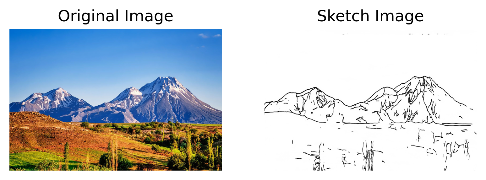

# ml-models

分享机器学习实验的代码，为相关方向的人员提供学习资源

## 环境需求

可通过 `requirements.txt` 文件安装所需第三方模块

```shell
pip3 install -r requirements.txt
```

## 数据依赖

以下依赖也可以使用软连接满足。

**注意**：如果出现模型缺失的情况，需要下载 `models` 文件夹，
并放在工程根目录下，即 `models/`

下载地址： [百度网盘](https://pan.baidu.com/s/1L7kbGovNyLAJIcSZVe8eqA) 提取码: gm3s

**注意**：如果出现数据集缺失的情况，需要下载 `dataset` 文件夹，
并放在工程根目录下，即 `dataset/`，并解压对应数据集

下载地址： [百度网盘](https://pan.baidu.com/s/1DjhpK2TAPGJbhXgoHKLt1Q) 提取码: dg82


## 模型介绍

### 11. Spade

[模型代码](src/spade.py)

根据mask标注信息生成图片

#### 模型依赖

可以从百度网盘下载，并放置到以下路径

`models/ml4a_spade`

#### 运行指令

```shell
python src/spade.py
```


### 10. Semantic Segmentation

[模型代码](src/semantic_segmentation.py)

对图片实现语义分割的功能，生成各种语意类别的mask

#### 模型依赖

可以从百度网盘下载，并放置到以下路径

`models/ml4a_semantic_segmentation`

#### 运行指令

```shell
python src/semantic_segmentation.py
```


### 9. PhotoSketch

[模型代码](src/photosketch.py)

将照片转换为简笔画

#### 模型依赖

可以从百度网盘下载，并放置到以下路径

`models/ml4a_photosketch/pretrained`

#### 运行指令

```shell
python src/photosketch.py
```



### 8. BASNet

[模型代码](src/basnet.py)

提取图片中前景物体的mask

#### 模型依赖

可以从百度网盘下载，并放置到以下路径

`models/ml4a_basnet/basnet.pth`

还依赖 `resnet34` 运行时联网会自动从pytorch官网下载

#### 运行指令

```shell
python src/basnet.py
```


### 7. dlib Face Recognition

[模型代码](src/dlib_face_recognition.py)

封装和展示dlib中人脸识别模型的效果

```shell
python src/dlib_face_recognition.py
```


### 6. dlib Face Alignment

[模型代码](src/dlib_face_alignment.py)

封装和展示dlib中人脸对齐模型的效果

```shell
python src/dlib_face_alignment.py
```


### 5. dlib Face Detection

[模型代码](src/dlib_face_detection.py)

封装和展示dlib中人脸检测器的效果

```shell
python src/dlib_face_detection.py
```


### 4. SVM (pytorch)

[模型代码](src/svm.py)

使用pytorch实现svm的hinge loss，
并用误差反传的迭代方式进行优化，仅供娱乐。

### 3. YoloX

[模型代码](src/yolox.py)

目标检测模型，包含训练和推理代码，
主要是针对官方代码中网络结构与损失严重耦合造成部署麻烦的问题，
将网络结构与训练技巧分开。

#### colab上训练的指令

```shell
python src/yolox.py --phase train --colab 1 --gpu 1 --batch_size 8
```

### 2. small VggNet

[模型代码](src/smallervgg_on_12306verifycode.py)

github上已经有一个12306验证码识别的[repo](https://github.com/wudinaonao/12306CaptchaCrack)，但是该程序内存的占用实在是有些浪费，以至于在我的小内存机器上无法正常运行，所以对数据集读取进行了一些优化。

#### 训练

```shell
python3 -m keras_exp.train_smallervgg_on_12306verifycode --dataset-dir=path/to/trainval/directory
```

#### 评估

```shell
python3 -m keras_exp.train_smallervgg_on_12306verifycode --phase=evaluate --dataset-dir=path/to/test/directory
```

验证集占比20%， batch_size默认设置为128，训练25个epoch可以达到的精度如下：
train_acc=99.0%, val_acc=99.1%, test_acc=95%

#### 指标

使用Small VggNet 对12306的验证码进行识别

|序号 ID|实验名 Experiment Name |精度 Acc|备注 Mark|
|:---:|:---:|:---:|:---:|
|1|smallervgg_bn_on_12306verifycode|acc=95%|With BN|


### 1. VggNet

[模型代码](src/vgg_on_celeba.py)
[CelebA-dataset](http://mmlab.ie.cuhk.edu.hk/projects/CelebA.html)

#### 指标

使用VggNet在CelebA数据集上测试分类效果

|序号 ID|实验名 Experiment Name |精度 Acc|备注 Mark|
|:---:|:---:|:---:|:---:|
|1| vggnet_on_celeba|acc=90.17%|Without BN|
|2|vggnet_bn_on_celeba|acc=90.62%|With BN|

