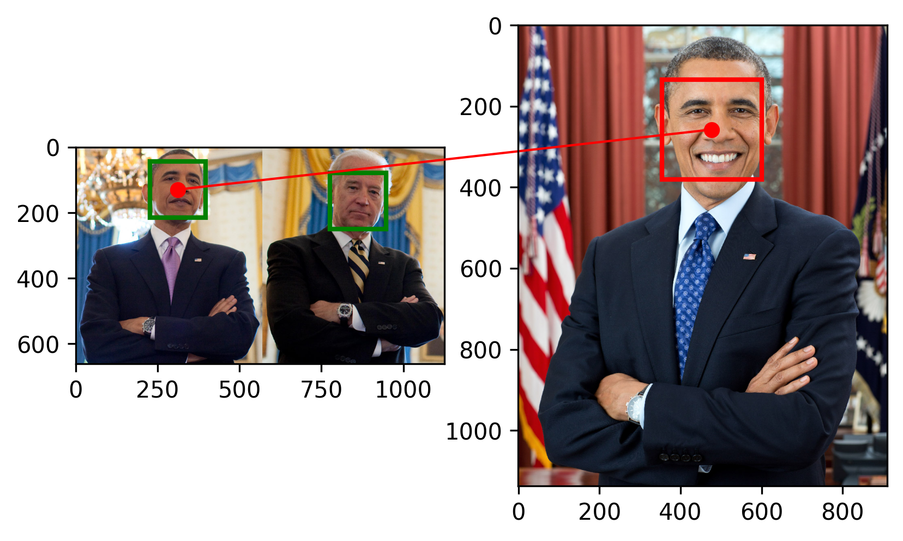
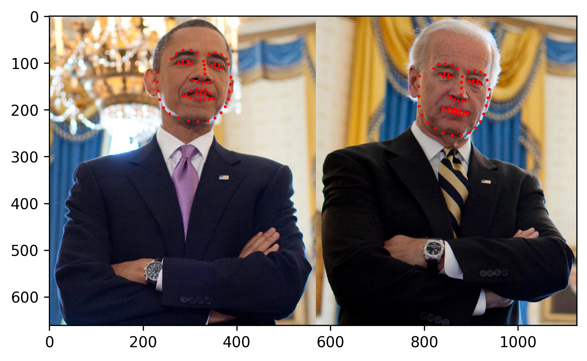

## dlib

### 3. dlib Face Recognition

[模型代码](src/dlib_face_recognition.py)

封装和展示dlib中人脸识别模型的效果

```shell
python src/dlib_face_recognition.py
```



### 2. dlib Face Alignment

[模型代码](src/dlib_face_alignment.py)

封装和展示dlib中人脸对齐模型的效果

```shell
python src/dlib_face_alignment.py
```



### 1. dlib Face Detection

[模型代码](src/dlib_face_detection.py)

封装和展示dlib中人脸检测器的效果

```shell
python src/dlib_face_detection.py
```

