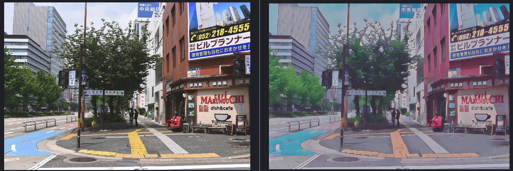

## ml4a

### 7. animestylized

由于官方提供的ckpt依赖特定的工程目录结构，因此无法运行。

想要直接运行，可以查看[官方源码](https://github.com/zhen8838/AnimeStylized)。

也可以从百度网盘下载处理过之后的模型文件。

依赖的vgg模型可以从百度网盘下载后放置到 `models/vggnet/vgg19.npy`

#### animegan

[模型代码](src/animestylized_animegan.py)

测试

```
python src/animestylized_animegan.py --config None --stage infer --ckpt models/animestylized/animeganv2/version_0/checkpoints/epoch=17_no_callbacks.ckpt --extra image_path:data/animestylized-samples/animegan_test2.jpg
```



数据集 

dataset/animestylized/dataset.zip

预训练

```
python src/animestylized_animegan_pretrainpy --config configs/animestylized/animegan_pretrain.yaml --stage fit
```

训练

```
python src/animestylized_animegan.py --config configs/animestylized/animeganv2.yaml --stage fit
```

#### whiteboxgan

[模型代码](src//animestylized_whiteboxgan.py)

测试

```
python src/animestylized_whiteboxgan.py --config None --stage infer --ckpt models/animestylized/whitebox/version_0/checkpoints/epoch=4_no_callbacks.ckpt --extra image_path:data/animestylized-samples//whitebox_test.jpg
```


数据集

dataset/animestylized/cvpr_dataset.zip

预训练

```
python src/animestylized_whitebox_pretrainpy --config configs/animestylized/whitebox_pretrain.yaml --stage fit
```

训练

```
python src/animestylized_whiteboxgan.py --config configs/animestylized/whitebox.yaml --stage fit
```

#### uagtit

[模型代码](src/animestylized_uagtit.py)

只能用于处理人脸

测试

```
python src/animestylized_uagtit.py --config None --stage infer --ckpt models/animestylized/uagtit/version_13/checkpoints/epoch=15_no_callbacks.ckpt --extra image_path:data/animestylized-samples/uagtit_test.png
```


数据集

dataset/animestylized/cvpr_dataset.zip


### 6. idinvert

[模型代码](src/idinvert.py)

可以修改属性的生成模型

#### 模型依赖

可以从百度网盘下载，并放置到以下路径

`models/ml4a_idinvert`

#### 运行指令

```shell
python src/idinvert.py
```


### 5. ESRGAN

[模型代码](src/esrgan.py)

生成4x超分辨率图像

#### 模型依赖

可以从百度网盘下载，并放置到以下路径

`models/ml4a_esrgan`

#### 运行指令

```shell
python src/esrgan.py
```


### 4. Spade

[模型代码](src/spade.py)

根据mask标注信息生成图片

#### 模型依赖

可以从百度网盘下载，并放置到以下路径

`models/ml4a_spade`

#### 运行指令

```shell
python src/spade.py
```


### 3. Semantic Segmentation

[模型代码](src/semantic_segmentation.py)

对图片实现语义分割的功能，生成各种语意类别的mask

#### 模型依赖

可以从百度网盘下载，并放置到以下路径

`models/ml4a_semantic_segmentation`

#### 运行指令

```shell
python src/semantic_segmentation.py
```


### 2. PhotoSketch

[模型代码](src/photosketch.py)

将照片转换为简笔画

#### 模型依赖

可以从百度网盘下载，并放置到以下路径

`models/ml4a_photosketch/pretrained`

#### 运行指令

```shell
python src/photosketch.py
```


### 1. BASNet

[模型代码](src/basnet.py)

提取图片中前景物体的mask

#### 模型依赖

可以从百度网盘下载，并放置到以下路径

`models/ml4a_basnet/basnet.pth`

还依赖 `resnet34` 运行时联网会自动从pytorch官网下载

#### 运行指令

```shell
python src/basnet.py
```

